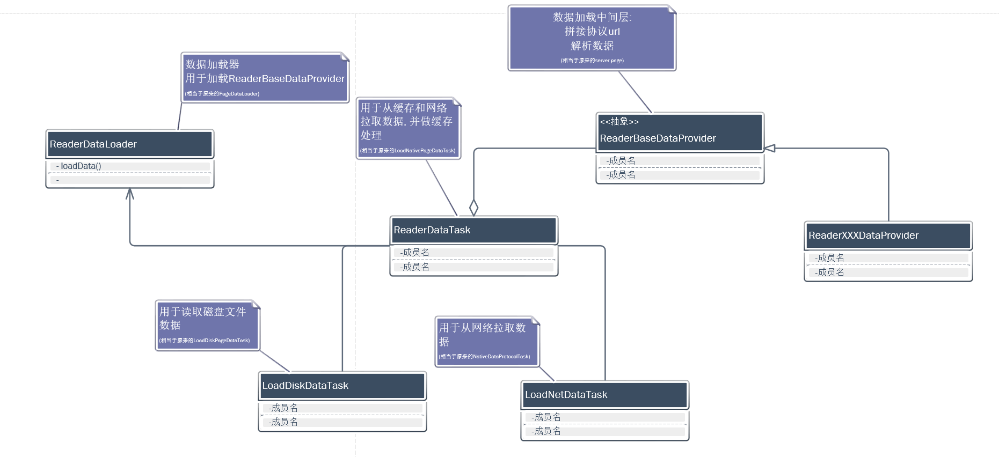
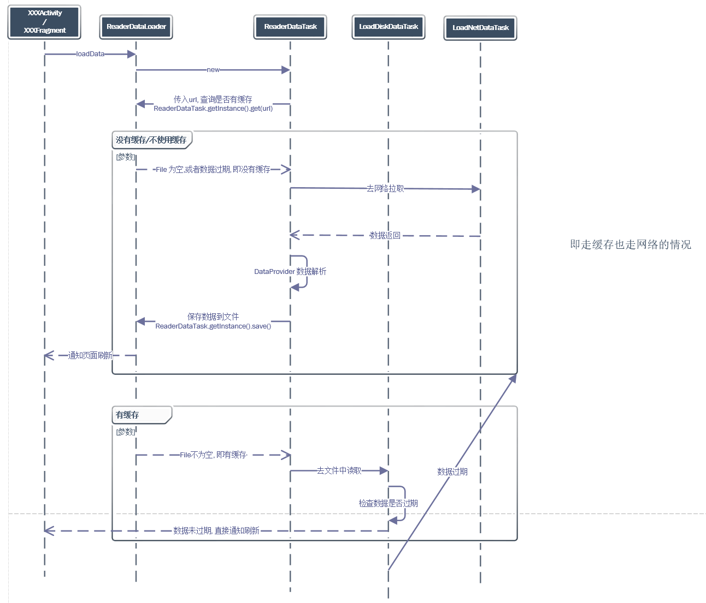

# 新版书城加载框架 DataProvider

## 类图

## 时序图

## 核心类介绍

**ReaderBaseDataProvider**

> 数据加载中间层

能力:

 1. 拼接协议url
 2. 请求协议（支持 GET POST 请求）
 3. 支持四种缓存类型（不使用缓存，只用网络数据失败时使用缓存，优先使用缓存，使用缓存但不使用过期数据）
 4. 解析数据

 **BaseDataItem**

> View 绑定层

职责:

1. View 和 Data 绑定
2. UI 相关逻辑处理，点击事件等
3. 埋点上报处理等

**ReaderDataLoader**

> 数据加载类

1. 加载 DataProvider
2. 支持多 DataProvider 并发请求
3. 支持并发请求外部广告

## 使用方式

1. 添加一个继承自 ReaderBaseDataProvider 的类，指定请求Bean和响应Bean泛型；
2. 实现 composeUrl() 用于拼接协议地址；
3. 实现 fillData() 用于构建 DataItem，添加到 mDataItems 中；
4. 根据需求添加继承自 BaseDataItem 的类；
5. 实现 getResLayoutId() 方法，返回当前 Item 的布局文件；
6. 实现 attachView() 方法，用于将 Data 绑定到 View；
7. 使用 ReaderDataLoader 加载 Provider。

> [注] 不要忘记在生命周期结束时调用 ReaderDataLoader.getInstance().unReceiveData()